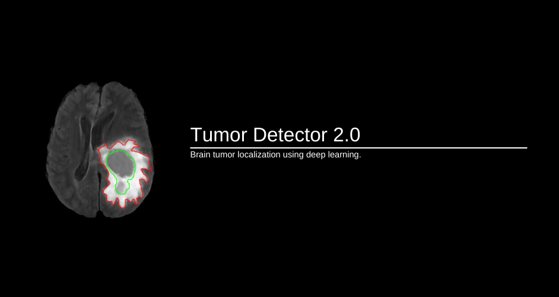
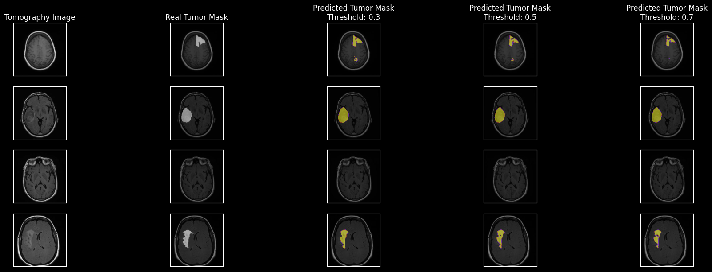

---
## **About**
Tumor Detector 2.0 consists in a neural network which has the capability to localize and segment tumors in tomography images. The goal of this project is to help the healthy professionals to identify quickly and more efficient anomalies in humans brain.

## **TumorNet**
- ### **Architecture**
    The main idea behind the TumorNet is based on **U-Net** architecture, which uses skip-connections to help the neural network to localize the extracted features from previous convolutional layers and applying Attention Gates to increase more the useful features than the background features after each concatenation during skip-connections process.

    The input of neural network is a grayscale image with size 256x256, it goes through the encoder block, which consists in some convolutional blocks 3x3 to extract the image features, and then, goes to the decoder block, which up-sample the image to the original size, generating as a output an matrix 256x256 with pixel values between 0-1 using a sigmoid activation function at final layer.

- ### **Training Inference**

    The training is made using *Binary Cross Entropy* to calculate the loss of model, the loss function is applied in each pixel of predicted mask, comparing to the label mask to calculate the error between both.

- ### **Validation Metric**
    The accuracy metric used can be either *Intersection Over Union* (IoU) or *Dice Coeficient* to calculate the overlapping between the predicted and the real mask. It gives us the accuracy of localization of the predicted mask.

## **Predictions**
The TumorNet was tested using three differents threshold values, which can easily interpreted as confidence score. Even with differents threshold, the same good result can be seen in all images.



---
## **Requirements**
- Python 3.9.13
- [CUDA 11.2](https://developer.nvidia.com/cuda-toolkit-archive)
- [cuDNN 8.1](https://developer.nvidia.com/rdp/cudnn-download)
- [Git](https://git-scm.com)
- Operation System
    - Windows 10
    - Ubuntu 22.04

## **Install**
Clone this repository to your computer running the command below on terminal.
```
$ git clone https://github.com/MTxSouza/Tumor-Detector-2.0
$ cd Tumor-Detector-2.0/
```

- ### *Recommended*
    It is strongly recommended to install this project in a separeted environment to avoid conflicts with other external packages of your computer. You can manually create a virtual environment using [Anaconda](https://www.anaconda.com) to install the project.
    ```
    $ conda create --name tumor2 python=3.9.13
    ```
    Otherwise, run the Makefile inside of the project folder you just cloned to make it automatically using the key-word 'env-create'. It will create a virtual environment using [Anaconda](https://www.anaconda.com), so make sure you have it installed in your machine.
    ```
    $ make env-create
    ```
    To activate your environment run the command below.
    ```
    $ conda activate tumor2
    ```
Next step is to run the script which will install the main package of project and it's requirements. To do it, run the command below.
```
$ pip install .
```
This step might take a while because it will install heavy packages to run the project.

After all the instalations, make sure all the packages was installed correctly running the tester script inside of prokect package.
```
$ python TumorDetector2/test/environment.py
```
It will certify all packages installed and it's versions if correspond to the necessary to run the project, and it will check if you have the GPU acceleration enabled to run training if you want to.